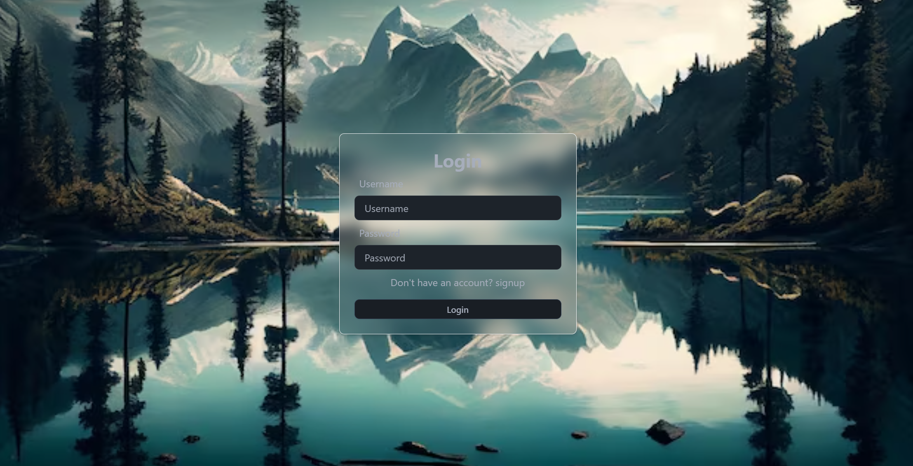

# Real-Time Chat Application

A modern, real-time Chat Application built using the **MERN stack**. This project enables instant messaging between users, real-time status updates, and a smooth chat experience powered by **Socket.io** and **Redux Toolkit**.

## 🚀 Features

- **User Authentication**  
  Secure signup and login using **JWT** and **Bcrypt** for password hashing.

- **User Dashboard**  
  Displays all registered users with profile pictures, active/offline status, and chat options using **React.js**.

- **Real-Time Messaging**  
  Bi-directional real-time communication between users with **Socket.io**.

- **State Management**  
  Handled seamlessly using **Redux Toolkit**.

- **Responsive UI/UX**  
  Built with **Tailwind CSS**, **DaisyUI**, and **Vite** for an optimized developer experience.

## 🖼️ Screenshots

### 🔐 Login Page
 <!-- Replace with your actual image path -->

### 📝 Signup Page
 <!-- Replace with your actual image path -->

### 💬 Chat Dashboard
 <!-- Replace with your actual image path -->

---

## 🛠️ Tech Stack

### Frontend
- React 19
- Redux Toolkit
- React Router
- Tailwind CSS
- DaisyUI
- Vite
- Axios

### Backend
- Node.js
- Express.js
- MongoDB with Mongoose
- JWT for authentication
- Bcrypt for password encryption
- Socket.io for real-time communication
- CORS and Cookie Parser

---

## 📦 Installation

### Prerequisites

- Node.js (v18 or higher)
- MongoDB (local or cloud)
- npm or yarn

---


### Frontend Setup
1. Navigate to the frontend directory:
   ```bash
   cd  Frontend
   ```

2. Install dependencies:
   ```bash
   npm install
   ```

3. Start the development server:
   ```bash
   npm run dev
   ```

### Backend Setup
1. Navigate to the backend directory:
   ```bash
   cd Backend
   ```

2. Install dependencies:
   ```bash
   npm install
   ```

3. Start the development server:
   ```bash
   npm run dev
   ```


## 🚀 Available Scripts

### Frontend
- `npm run dev` - Start development server
- `npm run build` - Build for production
- `npm run preview` - Preview production build
- `npm run lint` - Run ESLint

### Backend
- `npm run dev` - Start development server with nodemon

